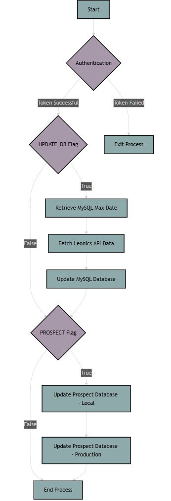

# UNHCR Data Integration Module

2024-01-17  v_0.4.3

This module facilitates the integration of data from the Leonics API into UNHCR's systems, specifically a MySQL database, and the Prospect system.  It handles authentication with the Leonics API, data retrieval, filtering, and updates to both target systems.

## Key Features

* **Automated Data Retrieval:**  Fetches data from the Leonics API within a specified timeframe, using an authentication token.
* **Incremental Updates:**  Updates both the MySQL database and Prospect with only new records since the last update, minimizing data transfer and redundancy.
* **Data Filtering:** Cleans and preprocesses the data by removing placeholder values, ensuring data quality.
* **Error Handling and Logging:** Includes logging for monitoring and debugging purposes, as well as error handling mechanisms.
* **Configuration via Environment Variables:** Sensitive data such as API keys and connection strings are stored securely using environment variables.

## Module Structure

The module is organized into several Python files:

* **`api.py`:** Handles interaction with the Leonics and Prospect APIs, including authentication and data retrieval/submission.
* **`db.py`:** Manages database operations, including updates to the MySQL database and interaction with Prospect.
* **`s3.py`:** Provides functionality for interacting with AWS S3 storage (currently used for listing files).
* **`utils.py`:** Contains utility functions for data cleaning and processing, such as filtering specific values from nested data structures.
* **`constants.py`:** Stores configuration constants such as API endpoints, database connection strings, and S3 credentials, loaded from a `.env` file.
* **`__main__.py`:** Entry point for the module when executed directly.
* **`__init__.py`:** Initializes the module and makes its functions accessible.

## Installation

For demonstration purposes I am using Windows and installing under: **_UNHCR\CODE**

1. **Clone the repository:**
   
    ```bash
    git clone https://github.com/unhcr-smh/unhcr_module.git
    cd _UNHCR\CODE\unhcr_module

2. **Create a virtual environment and activate it:**
   
    ```bash
    python3 -m venv .venv
    source .venv/bin/activate  # On Windows: .venv\Scripts\activate

3. Install the module
   
    ```bash
    pip install .

4. Edit the run.bat file if your absolute path is different
   
    ```batch
    REM change to your venv path if necessary
    call E:\_UNHCR\CODE\unhcr_module\.venv\Scripts\activate.bat
    python E:\_UNHCR\CODE\unhcr_module\unhcr\full_test.py --log INFO

6. Create a **.env** file in the project root directory. You need to get the secrets and API keys from Steve Hermes.
   Here is the **.env** without values:

    ```plaintext
    #[KOBO]
    KOBO_CREATE_ENGINE=
    KOBO_DATABASE=
    KOBO_HOST=
    KOBO_PASSWORD=
    KOBO_PORT=
    KOBO_SOURCE_FILE=
    KOBO_TABLE_NAME=
    KOBO_SHEET_NAME=
    KOBO_USER=
    KOBO_URL=
    KOBO_PROJECT_URL=
    KOBO_SSO_LOGIN=

    #[GB_2024]
    GB_2024_CREATE_ENGINE=

    #[GB_MISC]
    GB_MISC_CREATE_ENGINE=

    #[GB_2023]
    GB_2023_CREATE_ENGINE=

    #[GB_API_V1]
    GB_API_V1_API_BASE_URL=
    GB_API_V1_GET_DATA=
    GB_API_V1_GET_DEVICE_LIST=
    GB_API_V1_USER_KEY=

    #[GB_AWS]
    GB_AWS_ACCESS_KEY=
    GB_AWS_SECRET_KEY=
    GB_AWS_BUCKET_NAME=
    GB_AWS_FOLDER_NAME=

    #[PROTON]
    PROTON_RECOVERY_PHRASE=
    PROTON_URL=
    PROTON_USER=
    PROTON_PW=

    #[LEONICS]
    LEONICS_BASE_URL=
    LEONICS_USER_CODE=
    LEONICS_KEY=

    #[PROSPECT]
    PROS_LOCAL_BASE_URL=
    PROS_IN_LOCAL_API_KEY=
    PROS_OUT_LOCAL_API_KEY=
    PROS_BASE_URL=
    PROS_IN_API_KEY=
    PROS_OUT_API_KEY=

    #[AIVEN]
    AIVEN_TAKUM_LEONICS_API_RAW_CONN_STR=

    #[SOLARMAN NIGERIA]
    SM_APP_ID=
    SM_APP_SECRET=
    #[SM_BIZ] will expire every 2 months
    SM_BIZ_ACCESS_TOKEN=
    SM_URL=

7. Execute **run.bat** The output should be similar:

    ```cmd
    _UNHCR\CODE\unhcr_module>run

    2025-01-17 10:28:03,249 - INFO - PROD: False, DEBUG: False, LOCAL: True 1 .env file @: e:/_UNHCR/.env
    2025-01-17 10:28:03,251 - INFO - Process ID: 924   Log Level: INFO
    2025-01-17 10:28:03,253 - INFO - Version: 0.4.3   Error: None
    2025-01-17 10:28:03,253 - INFO - Getting auth token for date: 2025-01-17
    2025-01-17 10:28:20,323 - INFO - ROWS UPDATED: TAKUM_LEONICS_API_RAW  2
    2025-01-17 10:28:20,323 - INFO - Starting update_prospect ts: None  local = True
    2025-01-17 10:28:21,817 - INFO - 

    74a1680a57a88fbd56e4af59576d7d3e
    http://localhost:3000/api/v1/out/custom/?size=50&page=1&q[source_id_eq]=1&q[s]=created_at+desc
    2025-01-17 17:24
    2025-01-17 10:28:23,999 - INFO - 201:  {"id":637,"created_at":"2025-01-17T16:28:23.891Z","status":"Import started"}
    2025-01-17 10:28:24,000 - INFO - Data has been saved to 'py_pros'
    2025-01-17 10:28:24,000 - INFO - LOCAL: TRUE 201:  {"id":637,"created_at":"2025-01-17T16:28:23.891Z","status":"Import started"}
    2025-01-17 10:28:24,000 - INFO - Starting update_prospect ts: None  local = False
    2025-01-17 10:28:24,782 - INFO - 

    c91c1da9b43658800b079d52953d83f7
    https://app.prospect.energy/api/v1/out/custom/?size=50&page=1&q[source_id_eq]=421&q[s]=created_at+desc
    2025-01-17 16:53
    2025-01-17 10:28:27,043 - INFO - 201:  {"id":4974395,"created_at":"2025-01-17T16:28:27.175Z","status":"Import started"}
    2025-01-17 10:28:27,044 - INFO - Data has been saved to 'py_pros'
    2025-01-17 10:28:27,044 - INFO - LOCAL: FALSE 201:  {"id":4974395,"created_at":"2025-01-17T16:28:27.175Z","status":"Import started"}

## full_test.py Flow Chart



## Notes

    Update to v_0.4
    Allow running from local module files, or installed files. Note that constants has to initially be loaded from the installed version -- so install package before running the code locally
    Find .env file automatically
    Run using local files for development --- You must set PROD=1 in .env file before releasing to production
    Default to INFO logging level if bad commandline args
    Seperate code logically into modules --- move some misc logic into test code --- might put in misc module
    Break apart API module for Leonics and Prospect -- TODO -- same for db module

Logging goes to **_UNHCR\CODE\unhcr_module\unhcr.module.log**

If you set the log level to **DEBUG** your will get CSV files.

There is a bug when there are no new records:

    E:\_UNHCR\CODE\unhcr_module\.venv\Lib\site-packages\unhcr\db.py:144: FutureWarning: Setting an item of incompatible dtype is deprecated and will raise in a future error of pandas. Value '['2025-01-08 21:26']' has dtype incompatible with datetime64[ns], please explicitly cast to a compatible dtype first.
    df_filtered.loc[:, 'DateTimeServer'] = df_filtered['DateTimeServer'].dt.strftime('%Y-%m-%d %H:%M')
    Traceback (most recent call last):
    File "E:\_UNHCR\CODE\unhcr_module\.venv\Lib\site-packages\sqlalchemy\engine\base.py", line 1967, in _exec_single_context
        self.dialect.do_execute(
    File "E:\_UNHCR\CODE\unhcr_module\.venv\Lib\site-packages\sqlalchemy\engine\default.py", line 941, in do_execute
        cursor.execute(statement, parameters)
    File "E:\_UNHCR\CODE\unhcr_module\.venv\Lib\site-packages\MySQLdb\cursors.py", line 179, in execute
        res = self._query(mogrified_query)
            ^^^^^^^^^^^^^^^^^^^^^^^^^^^^
    File "E:\_UNHCR\CODE\unhcr_module\.venv\Lib\site-packages\MySQLdb\cursors.py", line 330, in _query
        db.query(q)
    File "E:\_UNHCR\CODE\unhcr_module\.venv\Lib\site-packages\MySQLdb\connections.py", line 265, in query
        _mysql.connection.query(self, query)
    MySQLdb.ProgrammingError: (1064, "You have an error in your SQL syntax; check the manual that corresponds to your MySQL server version for the right syntax to use near '21:26)' at line 1")

    The above exception was the direct cause of the following exception:

    Traceback (most recent call last):
    File "E:\_UNHCR\CODE\unhcr_module\.venv\Lib\site-packages\unhcr\db.py", line 104, in update_mysql
        update_rows(max_dt, token)
    File "E:\_UNHCR\CODE\unhcr_module\.venv\Lib\site-packages\unhcr\db.py", line 166, in update_rows
        res = mysql_execute(sql_query)
            ^^^^^^^^^^^^^^^^^^^^^^^^
    File "E:\_UNHCR\CODE\unhcr_module\.venv\Lib\site-packages\unhcr\db.py", line 76, in mysql_execute
        raise e
    File "E:\_UNHCR\CODE\unhcr_module\.venv\Lib\site-packages\unhcr\db.py", line 71, in mysql_execute
        result = session.execute(text(sql), {"data": data})
                ^^^^^^^^^^^^^^^^^^^^^^^^^^^^^^^^^^^^^^^^^^
    File "E:\_UNHCR\CODE\unhcr_module\.venv\Lib\site-packages\sqlalchemy\orm\session.py", line 2362, in execute
        return self._execute_internal(
            ^^^^^^^^^^^^^^^^^^^^^^^
    File "E:\_UNHCR\CODE\unhcr_module\.venv\Lib\site-packages\sqlalchemy\orm\session.py", line 2256, in _execute_internal
        result = conn.execute(
                ^^^^^^^^^^^^^
    File "E:\_UNHCR\CODE\unhcr_module\.venv\Lib\site-packages\sqlalchemy\engine\base.py", line 1418, in execute
        return meth(
            ^^^^^
    File "E:\_UNHCR\CODE\unhcr_module\.venv\Lib\site-packages\sqlalchemy\sql\elements.py", line 515, in _execute_on_connection
        return connection._execute_clauseelement(
            ^^^^^^^^^^^^^^^^^^^^^^^^^^^^^^^^^^
    File "E:\_UNHCR\CODE\unhcr_module\.venv\Lib\site-packages\sqlalchemy\engine\base.py", line 1640, in _execute_clauseelement
        ret = self._execute_context(
            ^^^^^^^^^^^^^^^^^^^^^^
    File "E:\_UNHCR\CODE\unhcr_module\.venv\Lib\site-packages\sqlalchemy\engine\base.py", line 1846, in _execute_context
        return self._exec_single_context(
            ^^^^^^^^^^^^^^^^^^^^^^^^^^
    File "E:\_UNHCR\CODE\unhcr_module\.venv\Lib\site-packages\sqlalchemy\engine\base.py", line 1986, in _exec_single_context
        self._handle_dbapi_exception(
    File "E:\_UNHCR\CODE\unhcr_module\.venv\Lib\site-packages\sqlalchemy\engine\base.py", line 2355, in _handle_dbapi_exception
        raise sqlalchemy_exception.with_traceback(exc_info[2]) from e
    File "E:\_UNHCR\CODE\unhcr_module\.venv\Lib\site-packages\sqlalchemy\engine\base.py", line 1967, in _exec_single_context
        self.dialect.do_execute(
    File "E:\_UNHCR\CODE\unhcr_module\.venv\Lib\site-packages\sqlalchemy\engine\default.py", line 941, in do_execute
        cursor.execute(statement, parameters)
    File "E:\_UNHCR\CODE\unhcr_module\.venv\Lib\site-packages\MySQLdb\cursors.py", line 179, in execute
        res = self._query(mogrified_query)
            ^^^^^^^^^^^^^^^^^^^^^^^^^^^^
    File "E:\_UNHCR\CODE\unhcr_module\.venv\Lib\site-packages\MySQLdb\cursors.py", line 330, in _query
        db.query(q)
    File "E:\_UNHCR\CODE\unhcr_module\.venv\Lib\site-packages\MySQLdb\connections.py", line 265, in query
        _mysql.connection.query(self, query)
    sqlalchemy.exc.ProgrammingError: (MySQLdb.ProgrammingError) (1064, "You have an error in your SQL syntax; check the manual that corresponds to your MySQL server version for the right syntax to use near '21:26)' at line 1")
    [SQL: INSERT INTO TAKUM_LEONICS_API_RAW (BDI1_ACinput_P1_kW, BDI1_ACinput_P2_kW, BDI1_ACinput_P3_kW, BDI1_ACinput_Total_kW, BDI1_ACinput_Voltage_L1, BDI1_ACinput_Voltage_L2, BDI1_ACinput_Voltage_L3, BDI1_Batt_Voltage, BDI1_Freq, BDI1_Power_P1_kW, BDI1_Power_P2_kW, BDI1_Power_P3_kW, BDI1_Todate_Supply_AC_kWh, BDI1_Today_Supply_AC_kWh, BDI1_Total_Power_kW, BDI2_ACinput_P1_kW, BDI2_ACinput_P2_kW, BDI2_ACinput_P3_kW, BDI2_ACinput_Total_kW, BDI2_ACinput_Voltage_L1, BDI2_ACinput_Voltage_L2, BDI2_ACinput_Voltage_L3, BDI2_Freq, BDI2_Power_P1_kW, BDI2_Power_P2_kW, BDI2_Power_P3_kW, BDI2_Todate_Batt_Chg_kWh, BDI2_Todate_Batt_DisChg_kWh, BDI2_Today_Batt_Chg_kWh, BDI2_Today_Batt_DisChg_kWh, BDI2_Total_Power_kW, DCgen_Alternator_Current, DCgen_Alternator_Power_kW, DCgen_Alternator_Temp, DCgen_Alternator_Voltage, DCgen_Ambient_Temp, DCgen_Coolant_Temp, DCgen_Diode_Temp, DCgen_Engine_Runtime, DCgen_Fuel_Level, DCgen_High_Voltage_Stop, DCgen_LoadBattery_Current, DCgen_LoadBattery_Power_kW, DCgen_LoadBattery_Voltage, DCgen_Low_Current_Stop, DCgen_Low_Voltage_Start, DCgen_Max_Current, DCgen_Max_RPM, DCgen_Max_Voltage, DCgen_Min_RPM, DCgen_Oil_Pressure, DCgen_RPM, DCgen_RPM_Frequency, DCgen_StartingBatteryVoltage, DCgen_Throttle_Stop, DCgen_Today_kWh, DCgen_Total_kWh, FlowMeter_Fuel_Temp, FlowMeter_Hourly_Fuel_consumptionRate, FlowMeter_Today_Fuel_consumption, FlowMeter_Total_Fuel_consumption, HVB1_Avg_V, HVB1_Batt_I, HVB1_SOC, In1_BDI_Fail, In2_ATS_Status, In3_door_sw, In4, In5, In6, In7, In8, LoadPM_Import_kWh, LoadPM_Power_P1_kW, LoadPM_Power_P2_kW, LoadPM_Power_P3_kW, LoadPM_Today_Import_kWh, LoadPM_Total_P_kW, Out1_CloseMC1, Out2_StartGen, Out3_EmergencyStop, Out4, Out5, Out6, Out7, Out8, SCC1_Chg_Current, SCC1_Chg_Power_kW, SCC1_Chg_Voltage, SCC1_PV_Current, SCC1_PV_Power_kW, SCC1_PV_Voltage, SCC1_Todate_Chg_kWh, SCC1_Todate_PV_kWh, SCC1_Today_Chg_kWh, SCC1_Today_PV_kWh, ana1_Inv_Room_Temp, ana2_Inv_room_RH, ana3_Batt_Room_Temp, ana4_Batt_room_RH, ana5_Fuel_Level1, ana6_Fuel_Level2, DateTimeServer) VALUES (0.0, 0.0, 0.0, 0.0, 0.6, 0.5, 0.4, 267.6, 50.0, 2.9, 1.3, 1.2, 15025.0, 136.0, 5.4, 0.0, 0.0, 0.0, 0.0, 0.2, 0.2, 0.7, 47.35, 0.0, 0.0, 0.0, 2736.52, 4261.7, 74.06, 68.74, 0.0, 64.17, 17.23, 77.38, 268.52, 84.68, 84.68, 51.08, 727.0, 24.37, 268.0, 64.17, 0.0, 0.0, 48.0, 260.0, 133.0, 28.0, 269.5, 6.5, 653.65, 22.8, 0.0, 13.66, 0.0, 139.0, 9342.0, NULL, NULL, 0.0, NULL, 267.6, 42.5, 86.4, 0.0, 0.0, 0.0, 0.0, 0.0, 0.0, 0.0, 0.0, 16027.4, 2.96, 1.39, 1.12, 137.66, 5.5, 0.0, 0.0, 0.0, 0.0, 0.0, 0.0, 0.0, 0.0, 0.3, 0.07, 268.6, 0.5, 0.02, 44.9, 1231.4, 1208.6, 11.0, 10.5, 30.4, 21.4, 13.5, 53.8, 8.6, 3.9, 2025-01-08 21:26);]
    (Background on this error at: https://sqlalche.me/e/20/f405)
    2025-01-08 14:28:11,949 - ERROR - ?????????????????update_mysql Error occurred: (MySQLdb.ProgrammingError) (1064, "You have an error in your SQL syntax; check the manual that corresponds to your MySQL server version for the right syntax to use near '21:26)' at line 1")
    [SQL: INSERT INTO TAKUM_LEONICS_API_RAW (BDI1_ACinput_P1_kW, BDI1_ACinput_P2_kW, BDI1_ACinput_P3_kW, BDI1_ACinput_Total_kW, BDI1_ACinput_Voltage_L1, BDI1_ACinput_Voltage_L2, BDI1_ACinput_Voltage_L3, BDI1_Batt_Voltage, BDI1_Freq, BDI1_Power_P1_kW, BDI1_Power_P2_kW, BDI1_Power_P3_kW, BDI1_Todate_Supply_AC_kWh, BDI1_Today_Supply_AC_kWh, BDI1_Total_Power_kW, BDI2_ACinput_P1_kW, BDI2_ACinput_P2_kW, BDI2_ACinput_P3_kW, BDI2_ACinput_Total_kW, BDI2_ACinput_Voltage_L1, BDI2_ACinput_Voltage_L2, BDI2_ACinput_Voltage_L3, BDI2_Freq, BDI2_Power_P1_kW, BDI2_Power_P2_kW, BDI2_Power_P3_kW, BDI2_Todate_Batt_Chg_kWh, BDI2_Todate_Batt_DisChg_kWh, BDI2_Today_Batt_Chg_kWh, BDI2_Today_Batt_DisChg_kWh, BDI2_Total_Power_kW, DCgen_Alternator_Current, DCgen_Alternator_Power_kW, DCgen_Alternator_Temp, DCgen_Alternator_Voltage, DCgen_Ambient_Temp, DCgen_Coolant_Temp, DCgen_Diode_Temp, DCgen_Engine_Runtime, DCgen_Fuel_Level, DCgen_High_Voltage_Stop, DCgen_LoadBattery_Current, DCgen_LoadBattery_Power_kW, DCgen_LoadBattery_Voltage, DCgen_Low_Current_Stop, DCgen_Low_Voltage_Start, DCgen_Max_Current, DCgen_Max_RPM, DCgen_Max_Voltage, DCgen_Min_RPM, DCgen_Oil_Pressure, DCgen_RPM, DCgen_RPM_Frequency, DCgen_StartingBatteryVoltage, DCgen_Throttle_Stop, DCgen_Today_kWh, DCgen_Total_kWh, FlowMeter_Fuel_Temp, FlowMeter_Hourly_Fuel_consumptionRate, FlowMeter_Today_Fuel_consumption, FlowMeter_Total_Fuel_consumption, HVB1_Avg_V, HVB1_Batt_I, HVB1_SOC, In1_BDI_Fail, In2_ATS_Status, In3_door_sw, In4, In5, In6, In7, In8, LoadPM_Import_kWh, LoadPM_Power_P1_kW, LoadPM_Power_P2_kW, LoadPM_Power_P3_kW, LoadPM_Today_Import_kWh, LoadPM_Total_P_kW, Out1_CloseMC1, Out2_StartGen, Out3_EmergencyStop, Out4, Out5, Out6, Out7, Out8, SCC1_Chg_Current, SCC1_Chg_Power_kW, SCC1_Chg_Voltage, SCC1_PV_Current, SCC1_PV_Power_kW, SCC1_PV_Voltage, SCC1_Todate_Chg_kWh, SCC1_Todate_PV_kWh, SCC1_Today_Chg_kWh, SCC1_Today_PV_kWh, ana1_Inv_Room_Temp, ana2_Inv_room_RH, ana3_Batt_Room_Temp, ana4_Batt_room_RH, ana5_Fuel_Level1, ana6_Fuel_Level2, DateTimeServer) VALUES (0.0, 0.0, 0.0, 0.0, 0.6, 0.5, 0.4, 267.6, 50.0, 2.9, 1.3, 1.2, 15025.0, 136.0, 5.4, 0.0, 0.0, 0.0, 0.0, 0.2, 0.2, 0.7, 47.35, 0.0, 0.0, 0.0, 2736.52, 4261.7, 74.06, 68.74, 0.0, 64.17, 17.23, 77.38, 268.52, 84.68, 84.68, 51.08, 727.0, 24.37, 268.0, 64.17, 0.0, 0.0, 48.0, 260.0, 133.0, 28.0, 269.5, 6.5, 653.65, 22.8, 0.0, 13.66, 0.0, 139.0, 9342.0, NULL, NULL, 0.0, NULL, 267.6, 42.5, 86.4, 0.0, 0.0, 0.0, 0.0, 0.0, 0.0, 0.0, 0.0, 16027.4, 2.96, 1.39, 1.12, 137.66, 5.5, 0.0, 0.0, 0.0, 0.0, 0.0, 0.0, 0.0, 0.0, 0.3, 0.07, 268.6, 0.5, 0.02, 44.9, 1231.4, 1208.6, 11.0, 10.5, 30.4, 21.4, 13.5, 53.8, 8.6, 3.9, 2025-01-08 21:26);]
    (Background on this error at: https://sqlalche.me/e/20/f405)
